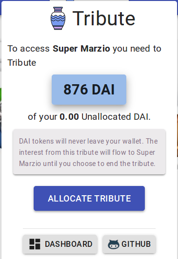
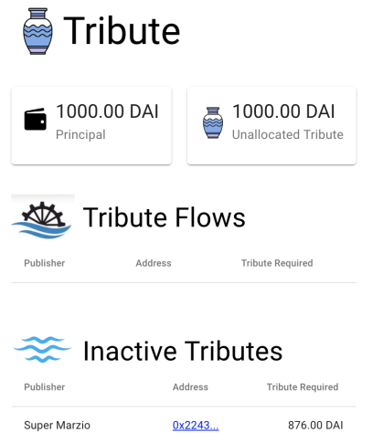

# Tribute - ETH Boston 2019

**"Hacking the Psychology of Money"**

Directed micro-payment metered subscription layer using rDAI

#### Widget



#### Dashboard



## Overview

Tribute is a web3 UI dashboard that calls the rDAI smart contracts and allows users and paid content publishers to transact using directed rDAI interest. It is designed to enable subscription access to paid content by allocating a portion of a user's rDAI interest to the publisher. The user's rDAI principal balance never goes down, but pays for services and content by foregoing the ability to keep the interest generated by their rDAI (which is tied to the Compound's DAI interest rate - at or above 10% for the past few months). Tribute enabled content publishers could be game or video streaming services, publications, charities or online casinos, among others.

To accept Tribute payments, a publisher specifies its wallet address and sets a meter rate and period to enable access to its content. When a user wishes to access the content, Tribute pulls the current DAI interest rate from Compound, and calculates how much DAI the user would need to allocate to satisfy the publisher's meter rate from interest alone.

For example, a news publication could set its meter rate at 20 DAI per year. At a DAI annual interest rate of 10% on Compound, a user would initially need to direct the interest on 200 DAI to satisfy the meter rate and access the publication. As another example, a platform game publisher could set its meter rate to 0.05 DAI per hour. A user would need to allocate 4,380 DAI as Tribute to play. (Compound divides a year into 2,102,400 blocks or 240 blocks per hour). Were the Compound DAI interest rate to be 7%, a user would need to initially allocate Tributes of ~286 DAI to the publication and ~6,257 DAI to the game to satisfy their meter rates. Tribute then calculates the percentage of the user's principal that this allocation corresponds to and prepares an rDAI contract transaction that specifies the publisher's address and the percentage of the user's interest that should flow to it.

These directed DAI interest flows are known as Allocated Tributes, and they are based on the DAI amount that was initially calculated based on the meter rate and the then-current Compound interest rate. The publisher bears the risk that the interest rate drops on Allocated Tribute, meaning that they receive less rDAI per block than what was initially calculated. Once a user allocates a Tribute to a publisher, the content should remain accessible as long as the user continues to direct the interest from the specified amount of DAI to the Publisher. Users always have the right to de-allocate any of their Tributes to publishers at any time. While Allocated Tributes direct proportional interest to publishers, the remaining user principal, called Unallocated Tribute, also generates interest via rDAI, but that interest flows back to the user, acting as a stealth savings module.

The key to Tribute is that users never see their interest-only payments to publishers leave their wallets because their principal amount never goes down. Users cannot "overspend" because they cannot subscribe to content that requires more Tribute than the remaining Unallocated Tribute. In fact, Tribute is designed so that transactions with publishers do not even feel like normal spending transactions. The rDAI mechanism of directed interest underlying Tribute is abstracted away from users. Publishers who enable Tribute benefit because users are more likely to pay for their content when they don't feel the financial loss as acutely as when paying out of pocket.

WARNING: Tribute is a hackathon proof-of-concept that is built on top of unaudited rDAI contracts, which themselves rely on DeFi contracts that may have additional potential security risks. You should not implement or use Tribute with real money or cryptoassets at stake.

What is rDAI? Please refer to [rDAI Documentation](https://redeem.money/index.html) and [How rDAI works.
](https://redeem.money)

### Obtaining rDAI

1. Retrieve ETH from the test faucet [Kovan Faucet](https://gitter.im/kovan-testnet/faucet) for transactions
2. Retrieve DAI from compound DAI faucet [Compound Faucet](https://app.compound.finance/asset/cDAI)
3. Approve Kovan DAI
   - Navigate to [OneClickDapp: DAI Token (Kovan)](https://oneclickdapp.com/tahiti-neptune) to approve rDAI contract
   - Give rDAI permissioned access to the DAI contract using the DAI contract's `approve()` method
   - Value of DAI allowance needs to be in WAD (10^18)
4. Convert DAI to rDAI:
   - Navigate to [OneClickDapp: rDAI Token (kovan)](https://oneclickdapp.com/verona-bless/)
   - use `mint()` to convert DAI to rDAI
   - Value of DAI to convert needs to be in WAD (10^18)
5. Success, you now have rDAI!

### Change Interest Recipients

1. Call `createHat()` on the rToken.sol Contract with the designated `recipient` and `proportions`

**_DEV NOTE: Proportions are displayed as uints in reference to `PROPORTION_BASE` which is `0xFFFFFFFF` or `4294967295`_**

## Terminology

---

### Publisher

- The party whose paid content (game, article, dapp) `Users` may want to access
- Sets the `Meter Rate` for access to their content

### User

- The party who wishes to access the `Publisher's` content in exchange for the allocation of `Tribute`

### Principal

- The `User's` DAI stack: comprised of 1) the amount of rDAI the `User` orginally minted, and 2) the interest that has accrued to the `User's` wallet

### Tribute

- A flow of interest accrued from a portion of a `User's` `Principal` that satifies a `Publisher's` `Meter Rate`

### Allocated Tribute

- An active `Tribute` to a `Publisher` that a `User` has authorized in exchange for access to the `Publisher's` content
- The amount of the `Allocated Tribute` is calculated as follows:
  > **Meter Rate (Per Block) / Compound DAI Interest Rate Per DAI Per Block (Current DAI APR / 2,102,400) = Allocated Tribute**
- To allocate a Tribute, the `User` signs a transaction that designates the `Publisher's` address as among the recipients and specifies the appropriate percentage of the `User's` `Principal` to direct the interest

### Unallocated Tribute

- The delta between `Principal` and the sum of all `Allocated Tributes`

### Meter Rate

- DAI per block fee set by the `Publisher`
- The `Publisher` may set both an amount of DAI and a time period (e.g. 20 DAI/year or 0.02 DAI/hour) in the UI but it will be converted to a per block rate
- `Publishers` bear the risk that the interest rate on DAI will drop while `Allocated Tributes` remain active, so they should factor in this risk in setting the `Meter Rate`

---

## Example:

1. `Publisher` sets the `Meter Rate` for access to their content
2. `User` visits the `Publisher's` content site
3. Tribute UI calculates the amount of DAI needed to satisfy the `Meter Rate` based on the current DAI interest rate on Compound and displays `Allocated Tribute` figure to `User`
4. `User` agrees to allocate `Tribute` to access content by signing Metamask `createHat()` transaction
5. Tribute will accrue to the `Publisher` until `User` ends the Tribute by signing another `createHat()` transaction

### rToken.sol

```
accounts mapping -> struct Accounts -> get
ByAddress() -> getHatByID() -> recipients and proportions
```

| address                    | proportion (%) |
| -------------------------- | -------------- |
| `User` wallet (0xabc...)   | 100            |
| `Publisher` (coolDapp.ETH) | 0              |

Dapp computes _at current interest rate_, what **proportion** of your stack will provide the **appropriate amount** of rDAI?

| address                    | proportion |
| -------------------------- | ---------- |
| `User` wallet (0xabc...)   | 90         |
| `Publisher` (coolDapp.ETH) | 10         |
